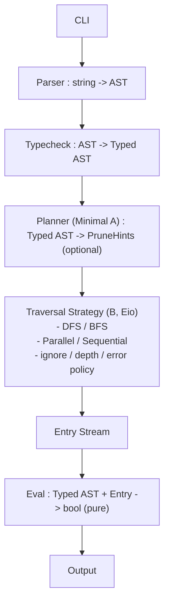

了解よ、ボス。
以下が これまでのすべての議論・追記（A最小＋B主軸＋Eio並列）を完全統合した「要件定義書・最終完全版（Markdown）」 です。
このまま README / docs/requirements.md / Antigravity 提出用として使える構成にしてある。

⸻

# 要件定義書（最終完全版）

## プロジェクト名

**quasi-find**  
（find もどき。find に敬意を払いながら、DSLとして再構成する実験的ツール）

---

## 1. 背景・目的

本プロジェクト **quasi-find** は、Unix の `find` コマンドに着想を得た  
**ファイルシステム探索用の DSL（Domain Specific Language）と評価エンジン**を  
OCaml で実装することを目的とする。

本ツールは `find` の完全互換や単純な置き換えを目指すものではない。  
むしろ以下を主目的とする：

- ファイル探索条件を **論理式（Expression）として記述**できること
- 条件式を **型付き DSL** として設計し、不正な組み合わせを排除できること
- DSL・AST・型チェック・評価器・走査を  
  **言語処理系として分離されたレイヤ構造**で実装すること
- find / fd / ripgrep の設計思想を比較・抽象化し、  
  **走査戦略として再構成すること**
- 並列性を含む実行戦略を **型と構造で安全に表現**すること

本プロジェクトは実用品である前に、  
**設計・理解・実験を目的とした思考実験的実装**である。

---

## 2. 想定利用シーン

- `find` の条件指定を「フラグの羅列」ではなく  
  **論理式として書きたい**場合
- ファイル探索を  
  **DSL・型・評価戦略・走査アルゴリズム・並列実行**の観点から再構成したい場合
- OCaml による DSL / 言語実装の学習・教材・趣味プロジェクト

※ 業務利用や完全互換性は必須要件としない。

---

## 3. 対象範囲（スコープ）

### 3.1 本プロジェクトのスコープ

#### 3.1.1 find 互換性・思想の継承

- GNU `find` を参照実装・思想的基準として扱う
- 完全互換は保証しないが、
  - 述語合成
  - 走査と判定の分離
    といった設計思想は意識的に取り込む
- 「どこが同じで、どこが異なるか」を README 等で説明可能にする

---

#### 3.1.2 ファイルシステム走査

- ディレクトリの再帰的走査を実装対象とする
- 走査は DSL 評価器とは独立した責務として設計する
- 以下を考慮する：
  - 深さ制御（max depth）
  - 除外ルール（skip patterns / well-known dirs）
  - エラー発生時のポリシー（warn / skip / fail-fast）
  - シンボリックリンク・再解析ポイントの扱い

---

#### 3.1.3 OS 差異の扱い

- Unix 系 OS と Windows の挙動差を設計上の前提として扱う
- 以下を考慮対象とする：
  - パス表現の違い
  - シンボリックリンク／再解析ポイント
  - パーミッション・アクセス拒否
- 差異を「隠す」のではなく、「どの層に影響するか」を明示する

---

#### 3.1.4 エラーハンドリング

- エラーを単なる例外ではなく **意味のある状態**として扱う
- 以下をスコープに含める：
  - stat 失敗
  - アクセス拒否
  - 壊れたリンク
- DSL 評価結果（true/false）とエラー状態を混同しない設計とする

---

#### 3.1.5 CLI

- CLI を正式な入力インターフェースとして扱う
- CLI の役割は以下に限定する：
  - DSL 文字列の受け取り
  - 走査戦略・並列度・各種ポリシーの指定
  - 結果の出力
- DSL・評価ロジックは lib 側に閉じ込める

---

### 3.2 明示的にスコープ外とするもの（非スコープ）

- GNU find との完全な挙動一致の保証
- 常に最速であることの保証
- 永続インデックス・常駐デーモン等の高度最適化
- セキュリティ監査・SLA・業務運用保証
- GUI / ネットワーク API

---

### 3.3 スコープ設計の思想

本プロジェクトのスコープは「やらない理由」ではなく、  
**どのレイヤで考えるかを固定するためのもの**である。

- DSL：何を探すか（意味）
- Typecheck：何が正しいか（正しさ）
- Eval：どう解釈するか（意味論）
- Traversal：どう辿るか（現実世界）
- Strategy：どう速く・どう並列に動かすか（実行計画）

---

## 4. 技術スタック

- 言語：OCaml
- ビルドツール：dune
- 並列・非同期基盤：**Eio**
- パーサ：Angstrom
- 正規表現：Re
- 実行形態：CLI

---

## 5. DSL 要件

### 5.1 DSL の位置づけ

- ファイル探索条件を表す **式言語**
- DSL は AST に変換され、型チェック後に評価される
- DSL 自体は副作用を持たない

---

### 5.2 DSL 文法（概念）

#### 論理演算

- `&&`（AND）
- `||`（OR）
- `!`（NOT）
- 括弧 `(` `)`

#### 比較演算

- `==`, `!=`
- `<`, `<=`, `>`, `>=`
- `=~`（正規表現マッチ）

#### フィールド

- `name` ：ファイル名
- `path` ：パス
- `type` ：file / dir / symlink
- `size` ：ファイルサイズ
- `mtime` ：更新時刻（現在からの経過）

#### 値

- 文字列 `"foo.txt"`
- 正規表現 `/.*\.ml$/`
- サイズ `10MB`, `4KiB`
- 期間 `7d`, `12h`, `30m`

---

### 5.3 DSL 記述例

```text
(name =~ /.*\.log$/ && type == file && size > 10MB)
|| (path =~ "^src/" && mtime < 7d)

```

6. 型付き DSL（Typed DSL）

6.1 目的

- DSL レベルで意味的に不正な式を排除する
- 実行時エラーを型チェック段階で検出する

  6.2 型エラー例

- size =~ "abc"
- mtime == 10MB
- type > file

  6.3 方針

- パース後の AST（untyped）を Typed AST に変換する
- 評価器は Typed AST のみを受け取る

7. 評価器（Eval）
   - 入力：Typed DSL + ファイルエントリ
   - 出力：bool
   - 純粋関数として設計する
   - ファイル情報取得（stat 等）は評価器の外側で行う

8. 高速な走査アルゴリズムと並列化

8.1 基本思想

- 高速化・並列化は設計対象とするが、最速競争は目的としない
- 「なぜ速くなるか」「なぜ安全か」を説明可能にする
- 走査はストリーミング（発見→即評価→出力/破棄）を基本とする
- 評価（Eval）は常に純粋関数とする

  8.2 高速化方針：Minimal A → B

(A) 最小限の静的枝刈り（Minimal Prune Extraction）

- DSL から 安全に抽出できる条件のみを走査に反映する
- 初期対象は以下に限定する：
  - path によるサブツリー限定（prefix）
  - 例：path =~ "^src/" / path starts_with "src/"
- 抽出不能な場合は枝刈りを行わない
- 探索漏れ（false negative）を絶対に起こさないことを要件とする
- A案は「高機能最適化」ではなく、DSLを走査計画に落とす最小のコンパイルとして位置付ける

(B) 走査戦略の第一級化（Traversal Strategy / 主戦場）

- 走査アルゴリズムを 戦略（Strategy）として型で表現する
- 以下を戦略として切替可能にする：
  - DFS / BFS
  - 深さ制限
  - 除外ルール
  - .gitignore 尊重
  - 隠しファイル／ディレクトリの扱い

(B) 走査戦略の第一級化（Traversal Strategy / 主戦場）

- 走査アルゴリズムを 戦略（Strategy）として型で表現する
- 以下を戦略として切替可能にする：
  - DFS / BFS
  - 深さ制限
  - 除外ルール
  - .gitignore 尊重
  - 隠しファイル／ディレクトリの扱い
  - シンボリックリンク追跡ポリシー
  - エラー処理方針
  - 並列／逐次

    8.3 Eio を用いた並列走査

    8.3.1 位置づけ

- 並列性は Traversal Strategy に限定して導入する
- DSL / 型チェック / Eval は並列性を意識しない
- Eio を用いた structured concurrency を採用する

  8.3.2 並列化の単位

- 並列化の基本単位は ディレクトリ（サブツリー）
- ファイル単位の過剰な並列化は行わない

  8.3.3 実行モデル

- Eio Switch と Fiber を用いて並列走査を構成する
- ワーカ数は設定可能とする
- エントリはストリームとして逐次下流へ流す

  8.3.4 非決定性の扱い

- 並列走査時の出力順は 非決定的であることを許容する
- 以下のモードを切替可能とする：
  - ordered：順序保持
  - unordered：最大スループット（デフォルト）

    8.3.5 エラー・キャンセル

- エラー時のポリシー：
  - fail-fast
  - best-effort
- Eio の Switch により構造化されたキャンセル伝播を行う

  8.3.6 バックプレッシャ

- Eval / Output が追いつかない場合、
- 走査側が無制限に先行しないよう制御する
- Eio の同期プリミティブを用いて流量を調整する

⸻

9. find / fd / ripgrep との関係

- find：柔軟な述語合成モデル
- fd：探索前フィルタ・デフォルト高速化
- ripgrep：探索空間縮小・枝刈り重視

quasi-findはfind の意味モデル × fd/ripgrep の高速化思想をDSL・型・走査戦略として再構成する。

10. アーキテクチャ概要（データフロー）



11. 非目標（再掲）
    • GNU find との完全互換
    • 常に最速であることの保証
    • 業務利用前提の品質保証
    • GUI / ネットワーク API

12. 成果物
    • dune プロジェクト一式
    • DSL 実装（AST / Parser / Typecheck / Eval）
    • Minimal A（path prefix に限る prune hints）
    • Traversal Strategy（逐次／並列・Eio）
    • CLI
    • README（設計思想・制約・非互換点）

13. 受け入れ基準（Done 定義）

13.1 DSL / 型

- 代表的な式がパース可能
- 型不整合な式が評価前にエラーとして検出される
- Typed AST のみが Eval に渡る

  13.2 Minimal A

- path サブツリー限定が抽出できる
- 抽出の有無で結果集合が変わらない（探索漏れゼロ）

  13.3 Traversal Strategy

- DFS/BFS 切替可能
- 深さ制限・除外・エラーポリシー切替可能

  13.4 Eio 並列

- 並列／逐次を切替可能
- 並列有無で結果集合が変わらない
- 出力順の非決定性が明示されている

14. 設計思想（まとめ）

quasi-find は find を作るプロジェクトではない。
find を“言語として読み替える”プロジェクトである。

DSL・型・評価・走査・並列性はすべて
思考と設計を可視化するための構成要素として扱う。
